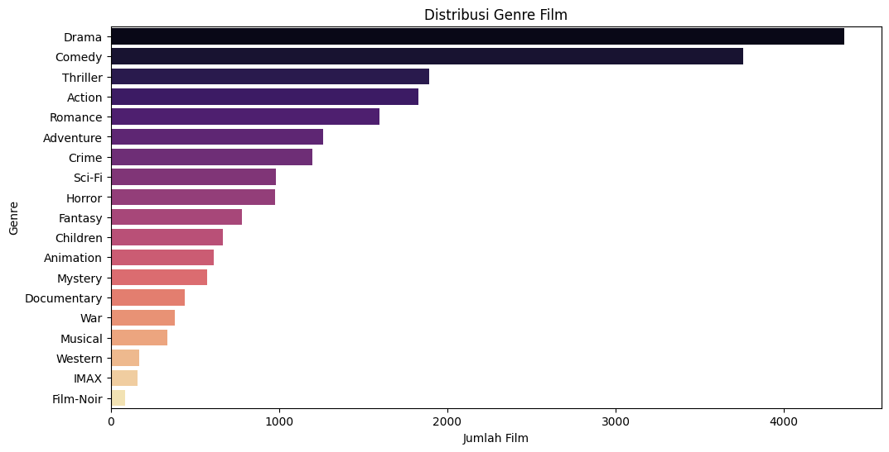
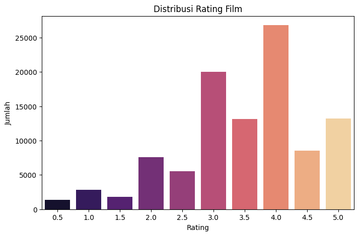
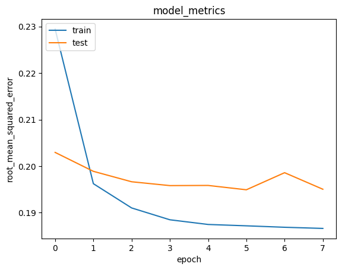

# 🎬 Film Recommendation System

## 📌 Project Overview

Dalam era digital saat ini, industri hiburan semakin bergantung pada sistem rekomendasi untuk meningkatkan keterlibatan pengguna. Netflix mengklaim bahwa lebih dari 80% jam tayang berasal dari sistem rekomendasi mereka, menandakan betapa krusialnya sistem ini dalam pengalaman pengguna. 
Meningkatnya jumlah konten membuat pengguna kesulitan dalam memilih film yang relevan dengan preferensi mereka. Oleh karena itu, proyek ini bertujuan untuk membangun sistem rekomendasi film yang mampu memberikan rekomendasi yang relevan bagi pengguna berdasarkan riwayat interaksi dan kesamaan konten. Proyek ini penting karena mampu meningkatkan user engagement dan pengalaman pengguna dalam menjelajahi film. Oleh karena itu, kemampuan untuk membangun model rekomendasi yang akurat dan relevan dapat berdampak signifikan secara bisnis.

> Referensi:  
> - [Netflix and the Power of Personalization](https://www.netflixtechblog.com)  
> - [MovieLens Dataset Overview](https://grouplens.org/datasets/movielens/)

## 💼 Business Understanding

### 🎯 Problem Statements
1. Bagaimana memberikan rekomendasi film kepada pengguna yang menyukai film tertentu?
2. Bagaimana memberikan rekomendasi film berdasarkan histori rating pengguna?

### 🥅 Goals
- Menghasilkan rekomendasi film yang relevan untuk pengguna.
- Mengukur performa rekomendasi secara kuantitatif.

### 🧭 Solution Approaches
Kami mengimplementasikan dua pendekatan sistem rekomendasi:
1. **Content-Based Filtering:** Menggunakan kemiripan genre film (TF-IDF + Cosine Similarity).
2. **Collaborative Filtering:** Menggunakan deep learning model berbasis embedding (dengan TensorFlow/Keras).

---

## 🧠 Data Understanding

### 📦 Dataset
Dataset yang digunakan berasal dari Kaggle dengan judul [Movie Lens Small Latest Datset](https://www.kaggle.com/datasets/shubhammehta21/movie-lens-small-latest-dataset/data)

### 🔢 Jumlah & Struktur Data
- **movies.csv:** 9,708 data film, dengan kolom `movieId`, `title`, dan `genres`.
- **ratings.csv:** 100,836 data rating oleh pengguna, dengan kolom `userId`, `movieId`, `rating`, dan `timestamp`.

### 🔍 Fitur
| Fitur       | Deskripsi                                     |
|-------------|-----------------------------------------------|
| `movieId`   | ID unik film                                  |
| `title`     | Judul film                                    |
| `genres`    | Genre film dalam format string (dipisah '|')  |
| `userId`    | ID unik pengguna                              |
| `rating`    | Nilai rating dari pengguna terhadap film      |

### 📊 Exploratory Data Analysis
1. 🎬 Distribusi Genre Film
   
   Genre yang paling mendominasi dalam dataset adalah Drama, diikuti oleh Comedy dan Thriller. Hal ini menunjukkan bahwa film dengan genre drama adalah yang paling sering diproduksi atau tersedia dalam data yang digunakan. Genre-genre seperti IMAX, Film-Noir, dan Western memiliki jumlah film yang jauh lebih sedikit, menunjukkan bahwa film dengan genre tersebut lebih jarang muncul. Distribusi ini dapat memengaruhi performa model, terutama pada sistem rekomendasi berbasis genre seperti content-based filtering, karena genre dominan akan lebih sering direkomendasikan.

2. ⭐ Distribusi Rating Film
  
Distribusi rating menunjukkan bahwa sebagian besar pengguna memberikan rating yang cukup tinggi terhadap film yang mereka tonton. Rating paling umum berada di angka 4.0, diikuti oleh 3.0 dan 5.0. Sebaliknya, rating rendah (seperti 0.5–1.5) jauh lebih jarang diberikan. Ini bisa menunjukkan bahwa pengguna cenderung lebih sering menonton dan menilai film yang mereka sukai, atau film dengan kualitas yang relatif baik. Pola ini penting untuk diperhatikan karena bisa menciptakan bias pada model rekomendasi, terutama pada pendekatan collaborative filtering.

---

## 🛠️ Data Preparation

### ✅ Langkah-Langkah
1. **Pivot Table:** Mengubah data rating ke bentuk matriks (userId x title).
2. **Missing Values:** Diisi dengan 0 (asumsi belum dirating).
3. **Encoding:** ID user dan judul film diubah ke indeks numerik.
4. **Filtering:** Hanya menyertakan user & film dengan minimal 5 rating.

### ⚙️ Alasan
- Encoding diperlukan agar bisa digunakan dalam embedding model.
- Filtering membantu fokus pada data yang informatif dan stabil.

---

## 🤖 Modeling and Results

### 1️⃣ Content-Based Filtering
- Menggunakan TF-IDF Vectorizer pada kolom `genres`.
- Menghitung cosine similarity antar film.
- Output: Top-5 film yang paling mirip dengan input judul film.

#### Contoh Output : 🎬 Rekomendasi Film Mirip dengan "Antitrust (2001)"
| No | Title                                      | Genres                  |
|----|--------------------------------------------|--------------------------|
| 1  | Transsiberian (2008)                       | Crime\|Drama\|Thriller   |
| 2  | Presumed Innocent (1990)                   | Crime\|Drama\|Thriller   |
| 3  | Out of Time (2003)                         | Crime\|Drama\|Thriller   |
| 4  | Taking of Pelham 1 2 3, The (2009)         | Crime\|Drama\|Thriller   |
| 5  | Before the Devil Knows You're Dead         | Crime\|Drama\|Thriller   |

### 2️⃣ Collaborative Filtering
- Dibuat dengan embedding layer untuk user dan film.
- Model dikembangkan dengan TensorFlow/Keras.
- Arsitektur mencakup:
  - Embedding + Bias untuk user dan film.
  - Dense Layer + Batch Normalization + Dropout.
  - Output: prediksi rating antara 0 dan 1 (dalam skala ternormalisasi).

#### Contoh Output : 🙋‍♂️ Top-10 Rekomendasi untuk Pengguna ID: 269
#### 🎞️ Movie dengan Rating Tinggi oleh Pengguna
| No | Judul                          | Genre                                  |
|----|--------------------------------|----------------------------------------|
| 1  | Heat (1995)                    | Action\|Crime\|Thriller                 |
| 2  | Bed of Roses (1996)           | Drama\|Romance                         |
| 3  | Toy Story (1995)              | Adventure\|Animation\|Children\|Comedy\|Fantasy |
| 4  | Craft, The (1996)             | Drama\|Fantasy\|Horror\|Thriller       |
| 5  | Leaving Las Vegas (1995)      | Drama\|Romance                         |

#### 🏆 Top-10 Film Rekomendasi
| No | Judul                                                                 | Genre                                       |
|----|-----------------------------------------------------------------------|---------------------------------------------|
| 1  | Lifeboat (1944)                                                      | Drama\|War                                  |
| 2  | Persona (1966)                                                       | Drama                                       |
| 3  | Guess Who's Coming to Dinner (1967)                                  | Drama                                       |
| 4  | Captain Fantastic (2016)                                             | Drama                                       |
| 5  | Trial, The (Procès, Le) (1962)                                       | Drama                                       |
| 6  | Three Billboards Outside Ebbing, Missouri (2017)                     | Crime\|Drama                                |
| 7  | Streetcar Named Desire, A (1951)                                     | Drama                                       |
| 8  | Harold and Maude (1971)                                              | Comedy\|Drama\|Romance                      |
| 9  | Day of the Doctor, The (2013)                                        | Adventure\|Drama\|Sci-Fi                    |
| 10 | Neon Genesis Evangelion: The End of Evangelion (1997)               | Action\|Animation\|Drama\|Fantasy\|Sci-Fi   |

### ⚖️ Kelebihan & Kekurangan

| Pendekatan             | Kelebihan                                        | Kekurangan                                      |
|------------------------|--------------------------------------------------|--------------------------------------------------|
| Content-Based Filtering | Tidak butuh data pengguna lain (cold start ok)  | Kurang variatif, hanya berdasarkan fitur film    |
| Collaborative Filtering| Bisa deteksi pola tersembunyi antar pengguna     | Butuh banyak data historis, cold start problem   |

---

## 📈 Evaluation

### 📐 Metrik Evaluasi
Kami menggunakan **Root Mean Squared Error (RMSE)** untuk collaborative filtering model.

#### Formula:
RMSE = √(1/n * Σ(yᵢ - ŷᵢ)²)
- RMSE rendah berarti prediksi model mendekati nilai sebenarnya.

### 📉 Evaluasi Performa Model Collaborative Filtering

Visualisasi di atas menunjukkan performa model Collaborative Filtering berbasis Neural Network yang dievaluasi menggunakan metrik Root Mean Squared Error (RMSE).
- Grafik menunjukkan tren penurunan nilai RMSE pada data pelatihan seiring bertambahnya epoch, yang berarti model semakin baik dalam memprediksi rating pengguna terhadap film seiring proses pelatihan.
- Untuk data pengujian, RMSE juga menurun secara konsisten sampai sekitar epoch ke-4, kemudian mulai menunjukkan fluktuasi kecil. Hal ini menandakan bahwa model berhasil belajar dengan baik tanpa overfitting secara signifikan.
- Nilai RMSE test yang tetap rendah mengindikasikan bahwa model memiliki generalisasi yang baik dalam merekomendasikan film kepada pengguna berdasarkan interaksi sebelumnya.
---

## ✅ Kesimpulan

Proyek ini berhasil membangun sistem rekomendasi film yang efektif dengan mengimplementasikan dua pendekatan utama: Content-Based Filtering dan Collaborative Filtering berbasis Deep Learning.

Dari sisi Content-Based Filtering, sistem mampu memberikan rekomendasi film yang serupa berdasarkan kesamaan genre. Ini berguna untuk pengguna baru (cold start) yang belum memiliki riwayat interaksi. Pendekatan ini memanfaatkan teknik TF-IDF Vectorization dan Cosine Similarity untuk mengukur kemiripan antar film. Hasilnya menunjukkan bahwa sistem dapat merekomendasikan film-film dengan genre yang sangat relevan terhadap film yang disukai pengguna.

Sementara itu, pendekatan Collaborative Filtering menggunakan embedding model neural network untuk mempelajari hubungan kompleks antara pengguna dan film berdasarkan data rating historis. Model ini menunjukkan performa yang baik dalam memprediksi preferensi pengguna secara personal, terbukti dari nilai RMSE yang rendah dan stabil pada data uji. Dengan arsitektur deep learning yang sederhana namun efektif (user/movie embedding, dense layers, dan dropout), sistem mampu menggeneralisasi dengan baik tanpa overfitting.

Dari perspektif bisnis, sistem ini menjawab dua pertanyaan utama:

- Bagaimana memberikan rekomendasi yang akurat untuk pengguna baru maupun lama?

- Bagaimana memanfaatkan data historis untuk meningkatkan personalisasi?

Dengan meningkatnya kualitas rekomendasi, sistem ini berpotensi meningkatkan user engagement, retensi pengguna, dan kepuasan dalam menjelajahi konten film, yang merupakan aspek krusial dalam platform hiburan digital seperti Netflix dan sejenisnya.

Secara keseluruhan, proyek ini membuktikan bahwa kombinasi pendekatan berbasis konten dan kolaboratif dapat menghasilkan sistem rekomendasi yang lebih komprehensif, akurat, dan relevan, serta memiliki dampak langsung terhadap pengalaman pengguna dan nilai bisnis platform.

---

## 📚 Resources
- TensorFlow Docs: [https://www.tensorflow.org/](https://www.tensorflow.org/)
- Scikit-learn Docs: [https://scikit-learn.org/](https://scikit-learn.org/)

---

> ✨ Proyek ini merupakan bagian dari submission program pembelajaran sistem rekomendasi berbasis machine learning.
